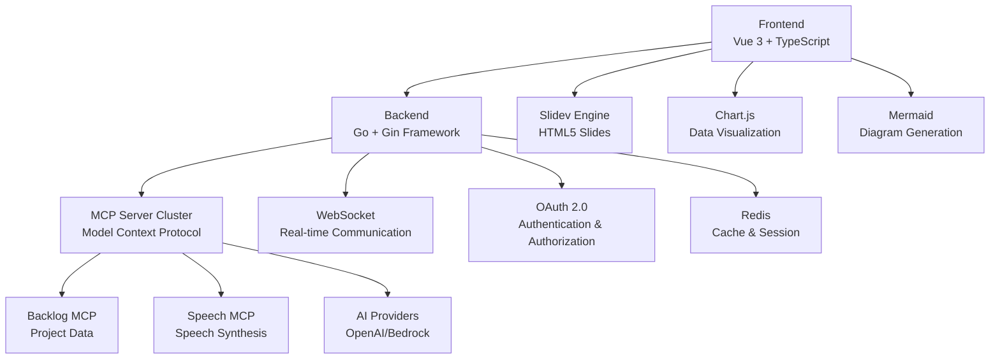

# Intelligent Presenter for HTML Slides

> An intelligent presentation system that automatically generates slides from Backlog project data using AI.

## 📋 Table of Contents

- [Overview](#overview)
- [Key Features](#key-features)
- [System Architecture](#system-architecture)
- [Tech Stack](#tech-stack)
- [Setup](#setup)
- [Usage](#usage)
- [API Specification](#api-specification)
- [Development Guide](#development-guide)
- [Testing](#testing)
- [Configuration](#configuration)
- [How to Contribute](#how-to-contribute)

## Overview

**Intelligent Presenter** is a next-generation platform that automatically analyzes Backlog project data with AI to generate high-quality HTML slide presentations for managers and stakeholders.

### 🎯 Key Objectives

- **Automated Reporting**: Reduce manual work and streamline project reporting.
- **AI-Driven Insights**: Automatically generate insights and visualizations from data.
- **Multimodal Presentations**: Combine text, graphs, and audio for comprehensive reports.
- **Real-time Delivery**: Asynchronous generation and sequential delivery via WebSockets.

## Key Features

### 🎨 10 Intelligent Slide Themes

| Theme | Description | Key Content |
|---|---|---|
| **Project Overview** | Basic project information | Purpose, duration, team structure, budget |
| **Project Progress** | Current progress status | Completion rate, milestones, timeline |
| **Issue Management** | Analysis of issue status | Unresolved issues, priority distribution, ongoing tasks |
| **Risk Analysis** | Identification of potential risks | Risk factors, impact level, mitigation plans |
| **Team Collaboration** | Evaluation of teamwork | Member composition, communication efficiency |
| **Document Management** | Status of knowledge sharing | Document count, update frequency, quality metrics |
| **Codebase Activity** | Analysis of development activity | Commit counts, developer contributions, code quality |
| **Notification Management**| Efficiency of information flow | Notification counts, response rates, communication |
| **Predictive Analysis** | Insights from AI predictions | Completion forecasts, risk probabilities, resource predictions |
| **Summary and Planning** | Project wrap-up | Key achievements, KPI attainment, next-phase planning |

### 🎬 Multimodal Content Generation

- **Slidev Integration**: Modern HTML5 slide rendering.
- **Mermaid Diagrams**: Automatic generation of flowcharts, pie charts, and Gantt charts.
- **Chart.js Visualization**: Interactive data visualization.
- **Japanese TTS**: Integration with VOICEVOX, Kokoro TTS, and MLX-Audio.
- **Real-time Delivery**: Asynchronous slide generation via WebSockets.

### 🎛️ Interactive Controls

- **Audio-enabled Presentations**: Automatic voice narration and subtitle support.
- **Fullscreen Mode**: Professional display.
- **Keyboard Shortcuts**: Intuitive controls (←→, Space, F, A, H, Esc).
- **Slide Navigation**: Thumbnail overview and direct jumping.

## System Architecture



### 🏗️ Key Components

#### Frontend (Vue 3 + TypeScript)
- **Presentation Viewer**: `/src/views/PresentationView.vue`
- **Slide State Management**: `/src/stores/slides.ts`
- **Slidev Integration**: `/src/services/slidev.ts`
- **Chart.js Integration**: `/src/components/ChartComponent.vue`

#### Backend (Go + Gin)
- **Slide Generation Service**: `/internal/services/slide.go`
- **Authentication Handler**: `/internal/api/handlers/auth.go`
- **WebSocket Hub**: `/internal/websocket/hub.go`
- **MCP Integration**: `/internal/mcp/client.go`

#### MCP Server Cluster
- **Backlog MCP**: `/backlog-server/main.go` - Access to project data
- **Speech MCP**: `/speech-server/cmd/main.go` - Multi-engine TTS

## Tech Stack

### Frontend
- **Vue 3** (Composition API) - UI Framework
- **TypeScript** - Type Safety
- **Pinia** - State Management
- **Vue Router** - Navigation
- **Vite** - Build Tool
- **Slidev** - Slide Engine
- **Chart.js** - Data Visualization
- **Mermaid** - Diagram Generation

### Backend
- **Go 1.21+** - Backend Language
- **Gin** - Web Framework
- **Gorilla WebSocket** - Real-time Communication
- **JWT-Go** - Authentication Tokens
- **Go-Redis** - Cache Access

### AI & Speech
- **OpenAI GPT-3.5-turbo** - Primary LLM Provider
- **AWS Bedrock Claude** - Fallback support
- **VOICEVOX** - High-quality Japanese TTS
- **Kokoro TTS** - Multilingual TTS
- **MLX-Audio** - macOS-optimized TTS

### Infrastructure
- **Docker & Docker Compose** - Containerization
- **Redis** - Cache & Session Management
- **Nginx** - Reverse Proxy (for production)

## Setup

### Prerequisites

- **Docker & Docker Compose** (latest version)
- **Node.js 18+**
- **Go 1.21+**
- **Backlog OAuth 2.0 Application** (created in developer settings)

### Environment Setup

1.  **Clone the repository**
    ```bash
    git clone <repository-url>
    cd intelligent-presenter
    ```

2.  **Set up environment variables**
    ```bash
    cp .env.example .env
    ```

    Edit the `.env` file:
    ```bash
    # Backlog Authentication Settings
    BACKLOG_DOMAIN=your-space.backlog.com
    BACKLOG_CLIENT_ID=your-oauth-client-id
    BACKLOG_CLIENT_SECRET=your-oauth-client-secret

    # AI Provider Settings
    OPENAI_API_KEY=your-openai-api-key
    AI_PROVIDER=openai

    # AWS Bedrock Settings (Optional)
    AWS_ACCESS_KEY_ID=your-aws-key
    AWS_SECRET_ACCESS_KEY=your-aws-secret
    AWS_REGION=ap-northeast-1

    # Application Settings
    FRONTEND_BASE_URL=http://localhost:3003
    BACKEND_BASE_URL=http://localhost:8081
    ```

3.  **Start with Docker Compose**
    ```bash
    # Start all services
    docker-compose up -d

    # View logs
    docker-compose logs -f
    ```

4.  **Run in Development Mode** (Optional)
    ```bash
    # Frontend development server
    cd frontend
    npm install
    npm run dev  # http://localhost:3003

    # Backend development server
    cd backend
    go mod tidy
    go run cmd/main.go  # http://localhost:8081
    ```

### Service Configuration

| Service | Port | Description | URL |
|---|---|---|---|
| Frontend | 3003 | Vue.js Application | http://localhost:3003 |
| Backend | 8081 | Go API Server | http://localhost:8081 |
| Speech MCP | 3002 | Speech Synthesis Service | Internal |
| VOICEVOX | 50021 | Japanese TTS Engine | Internal |
| Kokoro TTS | 8882 | Multilingual TTS Engine | Internal |
| Redis | 6379 | Cache & Session | Internal |

## Usage

### Basic Workflow

1.  **Authentication & Login**
    - Access http://localhost:3003 in your browser.
    - Click "Login with Backlog".
    - Complete the OAuth 2.0 authentication flow.

2.  **Project Selection**
    - Select the Backlog project to analyze.
    - Confirm project access permissions.

3.  **Slide Theme Selection**
    - Choose the slide themes you want to generate (multiple selections allowed).
    - Configure customization options.

4.  **Run AI Generation**
    - Click the "Generate Presentation" button.
    - View real-time progress via WebSocket.

5.  **View Presentation**
    - The slideshow will start automatically upon completion.
    - Enjoy the presentation with audio narration.

### Controls

#### Keyboard Shortcuts
- **←/→**: Previous/Next slide
- **Space**: Play/Pause
- **F**: Toggle fullscreen
- **A**: Toggle audio
- **H**: Show help
- **Esc**: Exit fullscreen

#### Mouse Controls
- **Slide Thumbnails**: Jump to a specific slide.
- **Audio Button**: Control audio playback.
- **Fullscreen Button**: Toggle display mode.

## API Specification

### Authentication API

#### OAuth 2.0 Flow
```http
GET /api/v1/auth/login
# Initiates Backlog OAuth 2.0 authentication

GET /api/v1/auth/callback?code=xxx&state=xxx
# OAuth authentication callback

POST /api/v1/auth/refresh
Content-Type: application/json
{
  "refresh_token": "xxx"
}
# Refresh access token

GET /api/v1/auth/me
Authorization: Bearer <access_token>
# Get user information

POST /api/v1/auth/logout
Authorization: Bearer <access_token>
# Logout
```

### Project API

#### Get Project Data
```http
GET /api/v1/projects
Authorization: Bearer <access_token>
# Get list of projects

GET /api/v1/projects/{project_id}/overview
Authorization: Bearer <access_token>
# Get project overview

GET /api/v1/projects/{project_id}/issues
Authorization: Bearer <access_token>
# Get list of issues

GET /api/v1/projects/{project_id}/progress
Authorization: Bearer <access_token>
# Get progress information
```

### Slide Generation API

#### Generation Flow
```http
POST /api/v1/slides/generate
Authorization: Bearer <access_token>
Content-Type: application/json
{
  "project_id": "SAMPLE",
  "themes": ["project_overview", "project_progress"],
  "options": {
    "language": "en",
    "voice_enabled": true,
    "charts_enabled": true
  }
}
# Start slide generation

GET /api/v1/slides/{slide_id}/status
Authorization: Bearer <access_token>
# Check generation status

WebSocket: /ws/slides/{slide_id}
Authorization: Bearer <access_token>
# Receive real-time updates
```

#### WebSocket Message Format
```json
{
  "type": "slide_generated",
  "data": {
    "slide_index": 1,
    "title": "Project Overview",
    "markdown": "# Project Overview
...",
    "html": "<h1>Project Overview</h1>...",
    "audio_url": "/api/v1/speech/audio/slide-1.wav"
  }
}

{
  "type": "generation_progress",
  "data": {
    "progress": 45,
    "current_theme": "project_progress",
    "message": "Analyzing progress data..."
  }
}

{
  "type": "generation_complete",
  "data": {
    "total_slides": 10,
    "generation_time": 45.2,
    "audio_enabled": true
  }
}
```

### Speech Synthesis API

```http
POST /api/v1/speech/synthesize
Authorization: Bearer <access_token>
Content-Type: application/json
{
  "text": "Hello, I will now report on the project's progress.",
  "voice": "voicevox",
  "speaker_id": 1,
  "speed": 1.0,
  "pitch": 0.0
}
# Synthesize speech

GET /api/v1/speech/audio/{filename}
Authorization: Bearer <access_token>
# Get audio file
```

## Development Guide

### Development Environment Setup

#### Frontend Development
```bash
cd frontend

# Install dependencies
npm install

# Start development server
npm run dev

# Build for production
npm run build

# Type check
npm run type-check

# Lint
npm run lint
```

#### Backend Development
```bash
cd backend

# Tidy dependencies
go mod tidy

# Start development server
go run cmd/main.go

# Build binary
go build -o bin/presenter cmd/main.go

# Run tests
go test ./...

# Format code
go fmt ./...
```

#### MCP Development
```bash
# Backlog MCP Development
cd backlog-server
go run main.go

# Speech MCP Development
cd speech-server
go run cmd/main.go
```

### Project Structure

```
intelligent-presenter/
├── frontend/                    # Vue.js Frontend
│   ├── src/
│   │   ├── views/              # Page components
│   │   ├── components/         # Reusable components
│   │   ├── stores/             # Pinia state management
│   │   ├── services/           # API clients
│   │   └── utils/              # Utilities
│   ├── tests/                  # Frontend tests
│   └── package.json
├── backend/                     # Go Backend
│   ├── cmd/                    # Entrypoint
│   ├── internal/
│   │   ├── api/               # REST API
│   │   ├── services/          # Business logic
│   │   ├── models/            # Data models
│   │   └── websocket/         # WebSocket handling
│   ├── tests/                 # Backend tests
│   └── go.mod
├── backlog-server/             # Backlog MCP Server
├── speech-server/              # Speech MCP Server
├── e2e-tests/                  # E2E tests (Playwright)
├── docs/                       # Documentation
├── docker-compose.yml          # Docker configuration
└── README.md
```

### Coding Conventions

#### TypeScript/Vue.js
- Follow **ESLint + Prettier** rules
- Use **Composition API**
- Prioritize **type safety** (avoid using `any`)
- Component Naming: **PascalCase**
- File Naming: **kebab-case**

#### Go
- Auto-format with **gofmt**
- Adhere to **golint** conventions
- Implement proper **error handling**
- Use **context** appropriately
- Maintain **test coverage** of 80% or higher

#### Commit Convention
```bash
# Conventional Commits format
feat(frontend): add slide navigation component
fix(backend): resolve WebSocket connection issue
docs(readme): update installation instructions
test(e2e): add presentation flow test
```

## Testing

### Test Configuration

#### Frontend Tests
```bash
cd frontend

# Run unit tests
npm run test

# Check test coverage
npm run test:coverage

# Run specific tests
npm run test -- --testNamePattern="slides store"
```

#### Backend Tests
```bash
cd backend

# Run all tests
go test ./...

# Run tests with coverage
go test -coverprofile=coverage.out ./...
go tool cover -html=coverage.out

# Test a specific package
go test ./internal/services
```

### Test File Structure

```
frontend/tests/
├── stores/
│   └── slides.test.ts          # Slide state management tests
├── utils/
│   └── slideUtils.test.ts      # Utility tests
└── components/
    └── ChartComponent.test.ts  # Component tests

backend/tests/
├── mcp_service_test.go         # MCP integration tests
├── slide_service_test.go       # Slide generation tests
└── auth_test.go               # Authentication tests

e2e-tests/
├── auth.spec.ts               # Authentication flow tests
├── slide-generation.spec.ts   # Slide generation tests
└── presentation.spec.ts       # Presentation tests
```

## Configuration

### Environment Variables

#### Required Settings
```bash
# Backlog OAuth Settings
BACKLOG_DOMAIN=your-space.backlog.com
BACKLOG_CLIENT_ID=your-client-id
BACKLOG_CLIENT_SECRET=your-client-secret

# AI Provider Settings
OPENAI_API_KEY=sk-xxx
AI_PROVIDER=openai  # openai or bedrock

# Application URLs
FRONTEND_BASE_URL=http://localhost:3003
BACKEND_BASE_URL=http://localhost:8081
```

#### Optional Settings
```bash
# AWS Bedrock Settings
AWS_ACCESS_KEY_ID=xxx
AWS_SECRET_ACCESS_KEY=xxx
AWS_REGION=ap-northeast-1

# Redis Settings
REDIS_URL=redis://localhost:6379
REDIS_PASSWORD=

# Speech Synthesis Settings
VOICEVOX_URL=http://localhost:50021
KOKORO_TTS_URL=http://localhost:8882
DEFAULT_TTS_ENGINE=voicevox

# Logging Settings
LOG_LEVEL=info  # debug, info, warn, error
LOG_FORMAT=json  # json or text

# Security Settings
JWT_SECRET=your-secret-key
SESSION_TIMEOUT=3600  # seconds
```

### Docker Configuration

#### Environment-specific Docker Compose files
```yaml
# Development: docker-compose.yml
# Production: docker-compose.prod.yml
# Testing: docker-compose.test.yml
```

#### Custom Docker commands
```bash
# Start specific services
docker-compose up frontend backend redis

# Start with production config
docker-compose -f docker-compose.prod.yml up -d

# Specify an environment file
docker-compose --env-file .env.production up -d
```

### Nginx Configuration (Production)

```nginx
server {
    listen 80;
    server_name your-domain.com;

    # Frontend
    location / {
        proxy_pass http://frontend:3003;
        proxy_set_header Host $host;
        proxy_set_header X-Real-IP $remote_addr;
    }

    # Backend API
    location /api/ {
        proxy_pass http://backend:8081;
        proxy_set_header Host $host;
        proxy_set_header X-Real-IP $remote_addr;
    }

    # WebSocket
    location /ws/ {
        proxy_pass http://backend:8081;
        proxy_http_version 1.1;
        proxy_set_header Upgrade $http_upgrade;
        proxy_set_header Connection "upgrade";
    }
}
```

## How to Contribute

### Development Workflow

1.  **Create an Issue**: Propose a new feature or bug fix.
2.  **Create a Branch**: `feature/xxx` or `fix/xxx`.
3.  **Develop & Test**: Implement changes and add tests.
4.  **Submit a Pull Request**: Get reviews and approval.
5.  **Merge**: Integrate into the main branch.

### Pull Request Requirements

- [ ] **Tests Pass**: All tests must succeed.
- [ ] **Code Coverage**: New code must have at least 80% test coverage.
- [ ] **Linter Passes**: No ESLint/golint errors.
- [ ] **Type Safety**: No TypeScript type errors.
- [ ] **Documentation Updated**: Update README/API specs if necessary.
- [ ] **Reviewer Approval**: At least one reviewer must approve.

### Issue/PR Templates

#### Feature Request Issue
```markdown
## Feature Summary
Add a "Security Analysis" slide theme.

## Background & Purpose
To visualize the security status of the project.

## Requirements
- [ ] Extract security-related issues.
- [ ] Analyze vulnerability levels.
- [ ] Generate mitigation suggestions.

## Design Proposal
...
```

#### Bug Report Issue
```markdown
## Bug Summary
Mermaid diagrams are not rendering correctly.

## Steps to Reproduce
1. Select a project.
2. Choose the "Project Progress" theme.
3. Run slide generation.

## Expected Behavior
The Mermaid diagram should be displayed correctly.

## Actual Behavior
The diagram is not displayed, and an error occurs.

## Environment
- Browser: Chrome 120
- OS: macOS 14
```

### Contributors

Thank you to everyone who has contributed to this project:

- Project Maintainers
- Community Contributors
- Testers & Reporters

---

**Intelligent Presenter** - An AI presentation system that automatically generates slides from Backlog project data.
